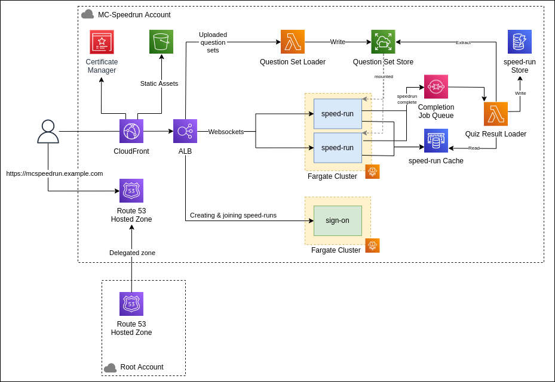

# AWS
- [1. Deploying](#1-deploying)
- [2. Architecture](#2-architecture)
  - [2.1 API Gateway](#21-api-gateway)
  - [2.2 Question Set Loader](#22-question-set-loader)
  - [2.3 Question Set Store](#23-question-set-store)
  - [2.4 speed-run Fargate Cluster](#24-speed-run-fargate-cluster)
  - [2.5 speed-run Cache](#25-speed-run-cache)
  - [2.6 speed-run Reporter](#26-speed-run-reporter)
  - [2.7 speed-run Store](#27-speed-run-store)
  - [2.8 sign-on](#28-sign-on)
  - [2.9 CloudFront](#29-cloudfront)

## 1. Deploying
TODO

## 2. Architecture

### 2.1 API Gateway 

An *HTTP API* typed gateway with three integrations:

- **question-set-loader** - Receives multipart/form-data at `POST /question-set-upload`. This facilatates client-side file upload.
- **speed-run Service Fargate Cluster** - Receives `GET /speedrun` requests which get upgraded to WebSocket connections.
- **sign-on** - Receives `/signon` requests

### 2.2 Question Set Loader
A lambda function that receives mutlipart/form-data from the the API gateway, processes it then writes it to Question Set Store (EFS) 

### 2.3 Question Set Store
An EFS file share mounted into each ECS.

### 2.4 speed-run Fargate Cluster
Application load balancer with multiple elastic scaling *speed-run* service containers. Each has the *Question Set Store* EFS mounted. *speed-run* persists current running speed-run state to *speed-run State* (Redis). On completion, sends a job to *Completion Job Queue*.

See [message protocol spec](docs/message-protocol.md) for the messages sent between the host/participants and speed-run instances.

### 2.5 speed-run Cache
An elasticached redis instance that stores state of in-progress speedruns. Also has a pub-sub mechanism for keeping all `speed-run` instances for a particular quiz session in sync.

### 2.6 speed-run Reporter
Lamda function that gets triggered when jobs are written to the *Completion Job Queue* (SQS standard queue). It extacts and loads the elasticache speed-run state into *speed-run Store*

### 2.7 speed-run Store
DynamoDB instance(s) for long term persistant store of completed speedruns.

### 2.8 sign-on
Facilitates hosts creating multiple choice speedruns and participants joining them. Initialises speedrun state in *speed-run State*. This service is anticipated to experience less load than *speed-run* services hence less instances in the cluster.

### 2.9 CloudFront
Serves static assets from S3, reverse-proxies requests to API gateway via AWS backbone network.

Will be something similar to: https://www.rehanvdm.com/blog/cloudfront-reverse-proxy-api-gateway-to-prevent-cors
