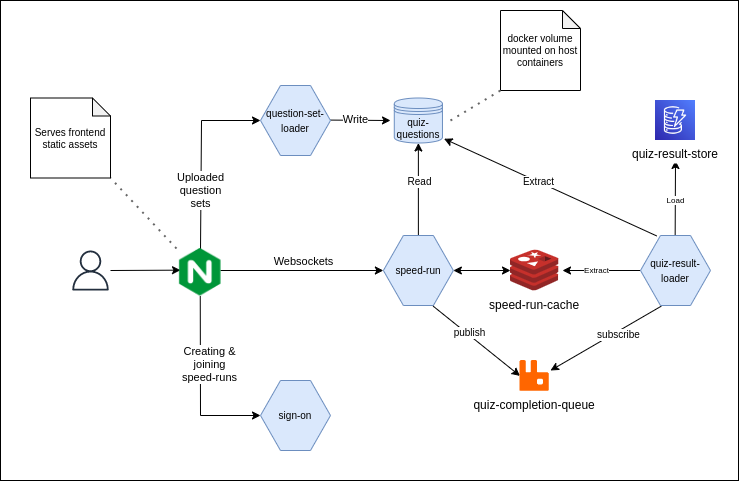

# Docker Compose

- [1. Usage](#1-usage)
  - [1.1 Setup](#11-setup)
  - [1.2 Deploying](#12-deploying)
  - [1.3 Destroying](#13-destroying)
- [2. Architecture](#2-architecture)
  - [2.1 NGINX](#21-nginx)
  - [2.2 Question Set Loader](#22-question-set-loader)
  - [2.3 Quiz Questions](#23-quiz-questions)
  - [2.4 Speed-run](#24-speed-run)
  - [2.5 Sign-on](#25-sign-on)
  - [2.6 Quiz Completion Queue](#26-quiz-completion-queue)
  - [2.7 Speed Run Cache](#27-speed-run-cache)
  - [2.8 Quiz Result Loader](#28-quiz-result-loader)
  - [2.9 Quiz Result Store](#29-quiz-result-store)
- [3. Tips and Tricks](#3-tips-and-tricks)
  - [3.1 Docker Compose Overrides](#31-docker-compose-overrides)
- [4. Troubleshooting](#4-troubleshooting)
  - [4.1 Check if the reverse-proxy can route to *sign-on*](#41-check-if-the-reverse-proxy-can-route-to-sign-on)
  - [4.2 Removing volumes](#42-removing-volumes)

## 1. Usage
### 1.1 Setup

a) Build the containers with `make build`

b) Run `make init` to bootstrap a `.env` file then configure it with the relevant details.

c) **Optionally**, install an HTTPS certificate and key at `secrets/server-crt.pem` and `secrets/server-key.pem` respectively. If this step is ignored, then a self-signed cert and corresponding key will be created at the above-stated paths.

### 1.2 Deploying

Run `make docker-compose-up` to launch the environment locally with the UI listening on localhost:443.

Browse to https://localhost to access the UI.

### 1.3 Destroying

`make docker-compose-up` leaves the environment running in the foreground with logs going to stdout. Optionally, you can press ctrl+c to terminate it and re-use the terminal for the following command.

To fully clean up the environment run `make docker-compose-down`.

## 2. Architecture



All services run in there own individual docker container.

### 2.1 NGINX

Runs a single NGINX process that acts as a web server for the static ui assets that are installed into the container at build time as well as a reverse-proxy to downstream servers that serve dynamic content. It terminates SSL and proxies all requests to downstream services over HTTP.

### 2.2 Question Set Loader

Receives proxies requests from the NGINX instance and writes the quiz files to the mounted docker volume.

### 2.3 Quiz Questions

A docker volume for storing questions sets. Its mounted in *Question Set Loader*, *Speed-run* and *Quiz Result Loader*.

### 2.4 Speed-run

Receives proxied websocket requests from the client via NGINX, persists in-flight quiz data to *Speed Run Cache*, reads question sets from *Quiz Questions* and enqueues quiz complete notification messages in *Quiz Completion Queue*. Multiple instances of the container run, such that if one is terminated, currently connected clients drop off and connect to the other instance. The instances also publish and subscribe to relayed messages between one another facilitated by the *Speed Run Cache*.

### 2.5 Sign-on

Receives proxied requests from NGINX and replies back with authentication related responses.

### 2.6 Quiz Completion Queue

The producer (*Speed Run*) sends messages to the RabbitMQ default exchange with routing key *quiz-complete* which routes it to the queue with the same name. The *Quiz Result Loader* receives the messages from the queue and auto-acknowledges its receival with the broker.

### 2.7 Speed Run Cache

A minimally configured single Redis instance. There's no password and "Protected mode" is turned off so the instance must not be exposed outside of this host otherwise anyone can access it.

### 2.8 Quiz Result Loader

Subscribes to the *quiz-complete* queue and upon receiving a message, reads the quiz file from the mounted docker volume, reads the quiz info from redis and writes aggregated and transformed data to *Quiz Result Store*.

### 2.9 Quiz Result Store

A DynamoDB local instance. This datastore was selected to minimise differences between the AWS deployment and this local docker-compose one.

## 3. Tips and Tricks

### 3.1 Docker Compose Overrides

The `docker-compose.override.yml.example` can be renamed to `docker-compose.override.yml` and will automatically merge with the regular `docker-compose.yml` file. This is useful for forwarding every services ports to the host and mounting the volume on the host to facilitate easier debugging. It can be useful to launch a service directly on the host with all others running in the compose environment.

## 4. Troubleshooting

### 4.1 Check if the reverse-proxy can route to *sign-on*

```bash
make docker-compose-up
docker exec deployment_reverse-proxy_1 curl -v -X POST http://sign-on:8080/sign-on/host/test
```
A JSON response containing a JWT token should be returned.

### 4.2 Removing volumes

```bash
docker-compose down -v
```